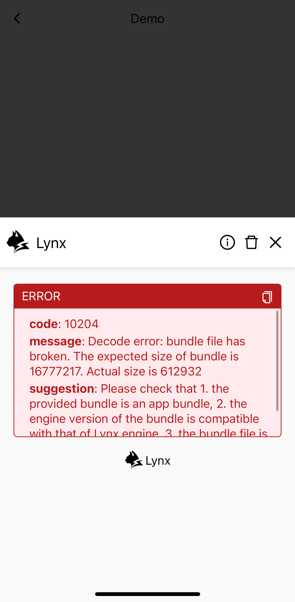
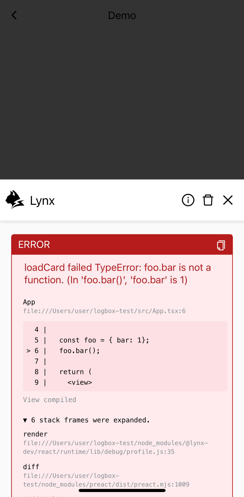

# 错误处理

## 在工具中发现错误

当你开发 Lynx 应用时，可能会遇到各种类型的错误，旨在让你快速了解刚刚发生的意外情况。

例如，如果某个 URL 无效或者当前无法访问，你会看到这样的报错：



有时候，你的 JavaScript 代码会包含一个 TypeError：



有时候，调用[原生模块](guide/spec.html#nativemodules)时传入的参数数量不正确：


借助开发工具（DevTool）或者消息盒子（LogBox），你会很轻松地发现他们。

## 消息盒子

正如你在上面已经看到的，这是一款用来显示错误的应用内工具

import base64_notify from './assets/logbox_message.jpeg?inline';
import base64_red from './assets/logbox_box.png?inline';

<div style={{ display: 'flex', justifyContent: 'flex-start', gap: '10px' }}>
  
  
</div>

它便于快速浏览，让你知道发生了什么。不过，对于开发工作，我们推荐使用桌面调试工具，它有更丰富的功能和更好的交互体验。

## 在代码中处理错误

现在让我们尝试对报错做些什么。

如果你想在代码中处理这些错误，可能会要先对[错误](api/errors/lynx-error)有一个整体的理解。

然后，这里是一个处理 [301](api/errors/error-code.html#eb_resource_image-301) 错误的例子

```tsx
const ImageErrorExample = () => {
  const [isImageError, setImageError] = useState(false);
  const handleImageError = (event: ErrorEvent) => {
    setImageError(true);
    console.log('Image loaded error:', JSON.stringify(event));
  };
  if (isImageError) {
    return <view />;
  }
  return (
    <view>
      <image
        className="my-image"
        src={'error url'}
        binderror={handleImageError}
      />
    </view>
  );
};
```

为了让开发者能够快速分类错误并找到解决方法，我们总结了所有错误并整理了一份[列表](api/errors/error-code)，包括错误代码、描述、级别、修复建议等。

请随意查阅！
