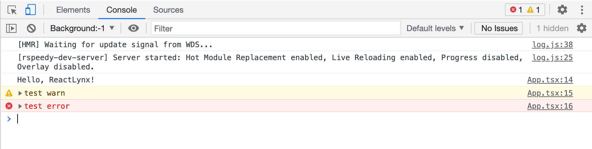
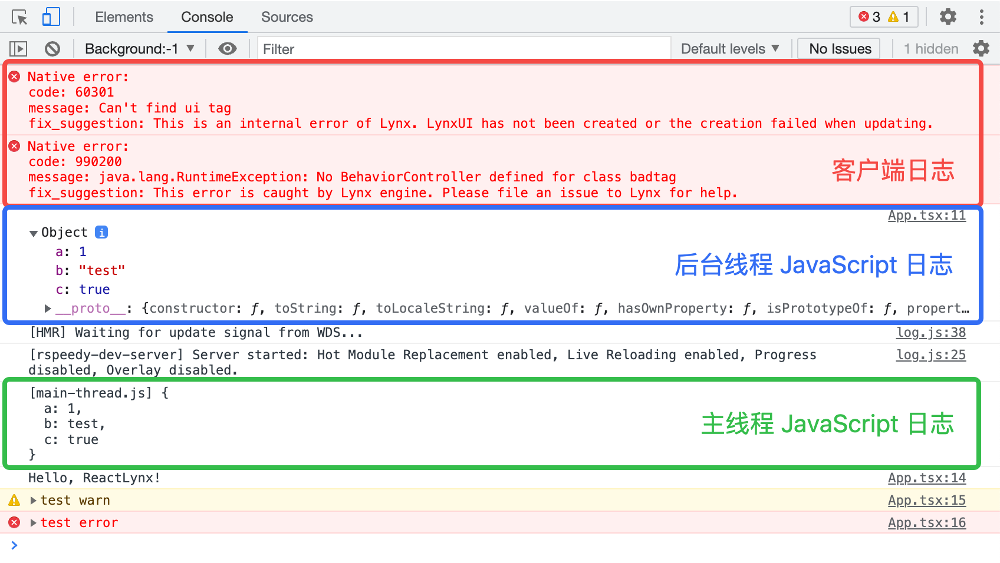
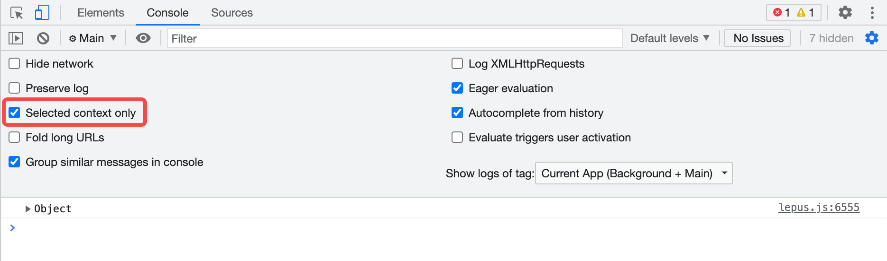
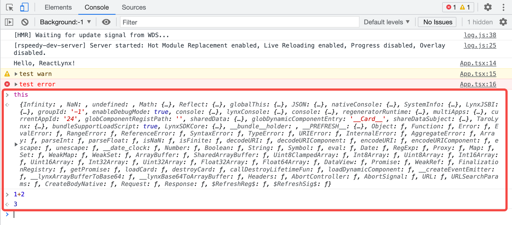
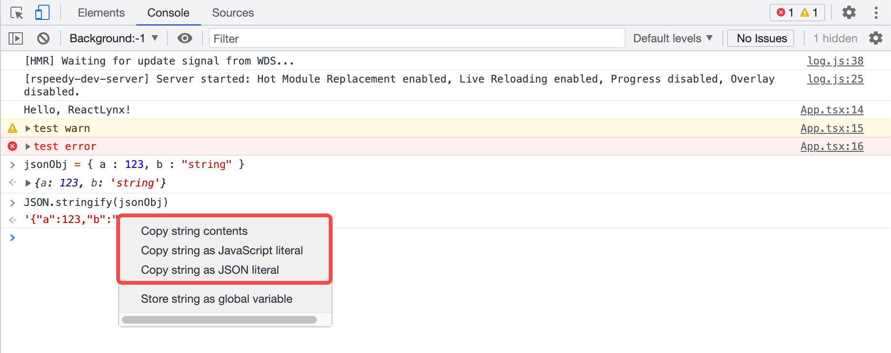

import console_settings from './assets/console/console-settings.png?inline';
import stack_trace_expand from './assets/console/stack-trace-expand.png?inline';
import clear_console_button from './assets/console/clear-console-button.png?inline';

<style jsx>{`
  .inline-content {
    display: flex;
    align-items: center;
    flex-wrap: wrap;
  }
  .inline-content img {
    margin: 0 5px;
    height: 2rem;
  }
  .margin {
    margin-top: 1rem;
    margin-bottom: 1rem;
  }
  .margin2 {
    margin-top: 0.5rem;
  }
`}</style>

# Console 面板

## 概览

使用 **Console** 面板可以[查看日志信息](#查看日志)和[运行 JavaScript](#运行-javascript)。在开始调试之前，你可以先了解 Lynx 的 [JavaScript 运行环境](guide/scripting-runtime/index#javascript-运行时)。



### 打开 Console 面板

可以将 Console 作为主面板或底部 Drawer 中的选项卡打开。

#### 在 Drawer 中打开

如果在使用其他面板的同时想查看 Console 面板，可以在 Drawer 中打开 Console。

请参考[在抽屉式菜单中打开控制台 | Chrome DevTools](https://developer.chrome.com/docs/devtools/console/reference?hl=zh-cn#drawer)。

### Console 设置

<div class="inline-content margin">
  <span>点击 **Console** 面板右上角的 **Console Settings**</span>
  
  <span>。</span>
</div>


下列链接对各项设置进行了说明：

- [Selected context only（仅限已选择的 Context）](#过滤来自不同-context-的日志)
- [Group similar messages in console（对相似日志进行分组）](#停用日志分组)
- [Eager evaluation（即时评估）](#停用即时评估)
- [Autocomplete from history（根据历史记录自动补全）](#停用根据历史记录自动补全)

### Console 侧边栏

请参考[打开控制台边栏 | Chrome DevTools](https://developer.chrome.com/docs/devtools/console/reference?hl=zh-cn#sidebar)。

## 查看日志

目前可以查看的日志类型包括：

1. **JavaScript 日志**。包括主线程和后台线程的 JavaScript 日志。
   - 默认情况下，后台线程日志会以完整的格式展示，主线程日志则会序列化为字符串类型进行展示，并带有 `[main-thread.js]` 前缀。
   - 开启[主线程 JavaScript 调试](./sources-panel.mdx#调试主线程-javascript-代码)后，主线程日志也会以完整的格式展示。
2. **部分客户端日志**。

   目前客户端运行时报错和其他部分客户端日志，会序列化为字符串形式展示在 Console 面板中。



### 日志来源

对于 JavaScript 日志，日志信息右侧的 `App.tsx:11` 是该日志在 JavaScript 中的位置，点击可以跳转到 [Sources](./sources-panel.mdx) 面板，并高亮显示打印这条日志的代码。


### 停用日志分组

DevTool 默认开启 **Group similar messages in console（对相似日志进行分组）**，连续产生的相似日志会被聚合在一起。


打开 [Console 设置](#console-设置)并禁用该选项后，原本集中展示的日志会被展开。


### 查看堆栈

<div class="inline-content margin">
  <span>对于 JavaScript 的错误和警告类型日志，点击**展开**</span>
  
  <span>，可以查看函数调用栈。</span>
</div>


### 过滤信息

#### 根据日志级别过滤

请参考[按日志级别过滤 | Chrome DevTools](https://developer.chrome.com/docs/devtools/console/reference?hl=zh-cn#level)。

:::tip
打开侧边栏时会无法点击日志级别下拉列表。
:::

#### 根据关键词过滤

请参考[按文字过滤 | Chrome DevTools](https://developer.chrome.com/docs/devtools/console/log?hl=zh-cn#text)。

#### 根据正则表达式过滤

请参考[按正则表达式过滤 | Chrome DevTools](https://developer.chrome.com/docs/devtools/console/log?hl=zh-cn#regex)。

#### 根据日志来源过滤

请参考[按网址过滤日志 | Chrome DevTools](https://developer.chrome.com/docs/devtools/console/reference?hl=zh-cn#url)。

#### 过滤来自不同 [Context](guide/spec#scripting-runtime-enviroment①) 的日志

默认情况下，只有后台线程的 Context，开启[主线程 JavaScript 调试](./sources-panel.mdx#调试主线程-javascript-代码)后，会增加一个主线程的 Context。

如下图，`Background:-1` 为后台线程，`Main` 为主线程。


[运行 JavaScript](#运行-javascript) 时，只会在当前选中的 Context 执行。

打开 [Console 设置](#console-设置)，选中 **Selected context only**，可以仅展示当前选中的 Context 的日志。



### 搜索文本

请参考[在日志中搜索文本 | Chrome DevTools](https://developer.chrome.com/docs/devtools/console/reference?hl=zh-cn#search)。

## 运行 JavaScript

控制台是一个 **REPL**，即“读取、求值、输出和循环”的缩写。它会读取输入的 JavaScript，评估代码，输出表达式的结果，然后循环返回第一步。

可以在 Console 中输入与当前页面有关的表达式，如 `this`。

也可以输入与当前页面无关的表达式，如 `1+2`。

按 Enter 后即可得到结果，Console 会在代码下方输出表达式的结果。



### 字符串复制选项

请参考[字符串复制选项 | Chrome DevTools](https://developer.chrome.com/docs/devtools/console/reference?hl=zh-cn#string-copy-options)。


例如，本例中，这三种选项复制得到的结果分别如下：
```javascript
{"a":123,"b":"string"}
'{"a":123,"b":"string"}'
"{\"a\":123,\"b\":\"string\"}"
```

### 重新运行历史表达式

请参考[从历史记录重新运行表达式 | Chrome DevTools](https://developer.chrome.com/docs/devtools/console/reference?hl=zh-cn#history)。

### 实时观察表达式的值

请参考[使用“实时表达式”实时查看表达式的值 | Chrome DevTools](https://developer.chrome.com/docs/devtools/console/live-expressions?hl=zh-cn)。

### 停用即时评估

请参考[停用提前评估 | Chrome DevTools](https://developer.chrome.com/docs/devtools/console/reference?hl=zh-cn#eagereval)。

### 停用根据历史记录自动补全

请参考[停用根据历史记录自动补全功能 | Chrome DevTools](https://developer.chrome.com/docs/devtools/console/reference?hl=zh-cn#autocomplete)。

## 清空日志

可以使用以下方法清空 Console 中的日志。

- <div class="inline-content margin2">
    <span>点击 **Clear Console** </span>
    
    <span>。</span>
  </div>
- 右击一条日志，然后选择 **Clear Console**。
- 在 Console 处于焦点时，按 Control+L 或 Command+K(Mac)。


