# Elements 面板

使用 **Elements** 面板可以检查和修改元件。

## 概览

**Elements** 面板提供了一个可用于检查和操控元件的强大界面。你可以利用元件树选择特定的元件节点，并使用其他工具进行修改。

**Elements** 面板还包含以下相关工具的标签页：

- **Styles:**
  - [查看和调试](#查看和更改-css)所有样式表中应用于某个元素的 CSS 规则。
  - 查找任何[无效、被替换或其他无法正常运行的 CSS](#查找无效或已替换和其他-css)。
  - 通过[添加声明](#向元素添加-css-声明)以及与 [Box model](#通过-box-model-与预览窗口中元素的交互) 交互，修改元素。
- **Computed:** 列出 Lynx 页面呈现某个元素时应用于元素的已解析属性。

### 打开 Elements 面板

默认情况下，当你打开 Lynx DevTool 桌面应用并连接上设备调试 Lynx 页面时，**Elements** 面板会打开。

如需手动打开或从其他面板切换回 **Elements** 面板，在 DevTool 窗口的主面板中点击 **Elements** 选项卡即可。

### 预览窗口

**Elements** 面板左侧是 Lynx 页面预览窗口，实时展示移动端的 Lynx 页面内容。

#### 预览窗口介绍

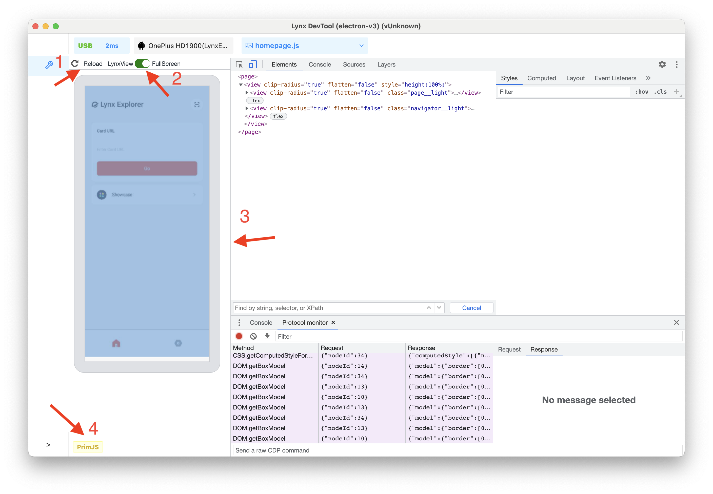

如上图所示：

1. 点击左上方 reload 图标，可刷新 Lynx 页面。
2. 切换当前预览模式, 有 LynxView 和 FullScreen 两种模式。
   - 如果移动端屏幕上存在多个 Lynx 页面，推荐 LynxView 预览模式，这样可专注于当前选中的 Lynx 页面。
   - 如果 Lynx 页面存在 overlay 组件（该组件在独立的窗口，可能在 LynxView 显示区域之外），推荐用全屏模式，此时截取移动端整个屏幕内容。
3. 分割 **Elements** 面板和预览窗口的边框，拖动此边框可调整预览窗口大小。
4. 展示当前卡片使用的 JS 引擎。

#### 打开/关闭预览窗口

点击该图标，可以打开/关闭预览窗口。

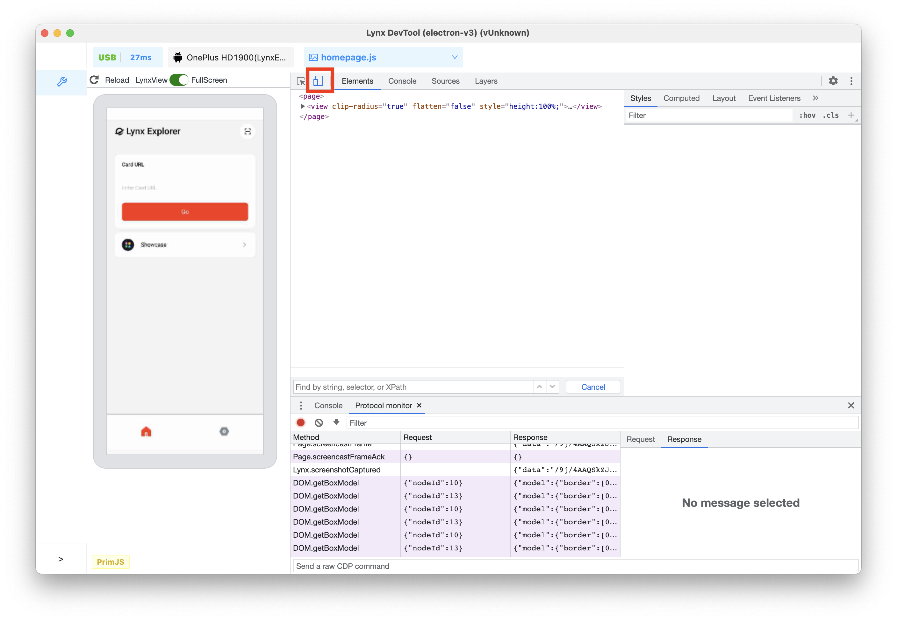

关闭后显示如下：

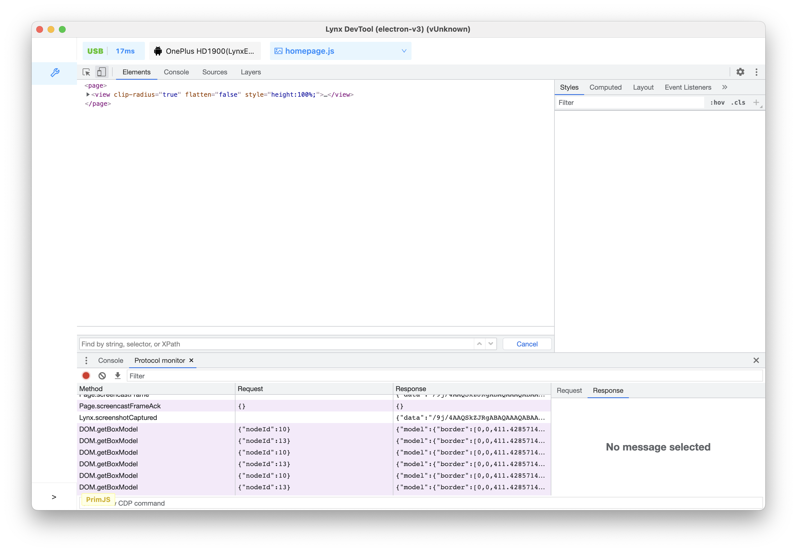

此时如果在 **Elements** 面板选中可生成 UI 的节点 (元件树上并非所有节点最终都会生成 UI)，移动端 Lynx 页面会高亮对应的 UI。

## 查看元件节点

### 检查节点

1. 点击开发者工具左上角的 **Inspect** 图标。

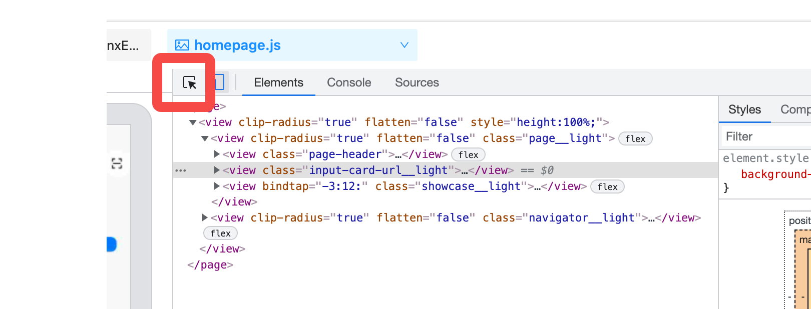

2. 点击预览窗口左上角的 logo。

3. 此时，DOM 树中突出显示了对应的 `<image></image>` 节点。

### 使用键盘浏览元件树

在元件树中选择某个节点后，你可以使用键盘浏览元件树。

1.  点击开发者工具左上角的 **Inspect** 图标后，点击 Lynx 页面预览中的 **input** 输入框。

    

    现在，DOM 树中选择了 `<input>` 节点。

2.  按向上箭头键 2 次，已选择 `<view class="input-card-url__light">`。

    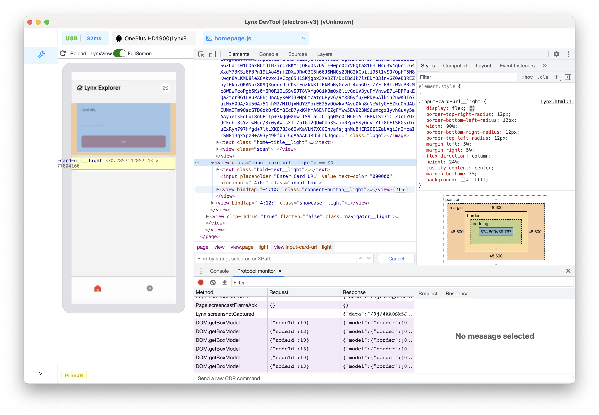

3.  按向左键，`<view class="input-card-url__light">` 的子节点均会收起。

4.  再次按向左键，选择了 `<view class="input-card-url__light">` 的父级 `<view class="page__light">`。

5.  按向下箭头键 2 次，重新选择你刚刚收起的 `<view class="input-card-url__light">` 节点，显示的内容: `<view class="input-card-url__light">...</view>`。

6.  按向右箭头键，此时 `<view class="input-card-url__light">` 节点会展开。

## 更改元件节点

你可以动态修改元件树，并查看这些更改对 Lynx 页面有何影响。

### 修改内容

如需修改节点的内容，请在元件树中双击相应内容。

1. 点击 **Inspect** 图标后, 在 Lynx 页面预览中点击 **Lynx Explorer** 文字，此时元件树选中了 `<text class="home-title__light">...</text>` 节点。

   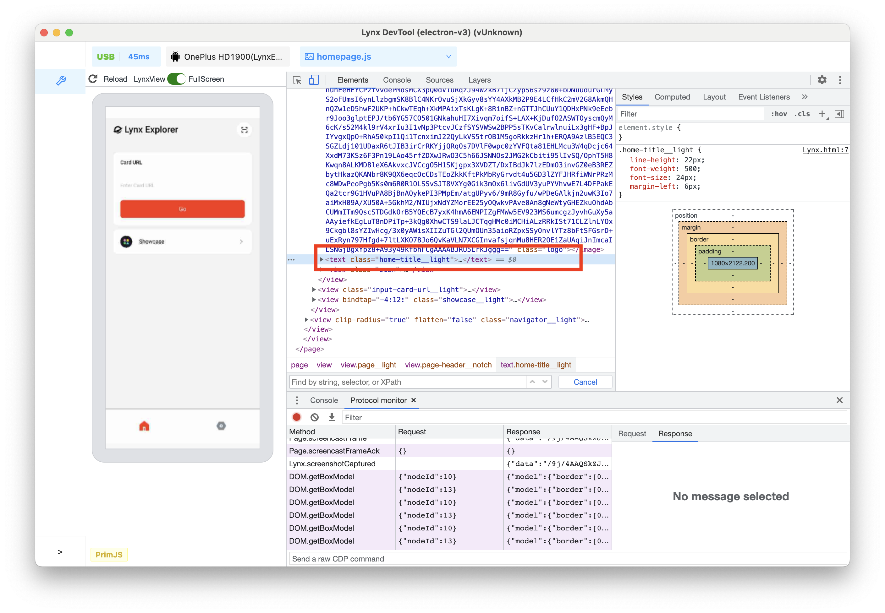

2. 键盘按向右箭头键，展开 `<text class="home-title__light">...</text>` 节点。

3. 键盘按向下箭头键，DOM 树选中了 `<raw-text text="Lynx Explorer"><raw-text>` 节点。

4. 双击 `<raw-text>` 上的 **Lynx Explorer**。

5. 修改内容为 **Hello world**。

   

6. 按下回车键，可以看到无论是元件树还是左侧预览窗口，文字改动均已生效。
   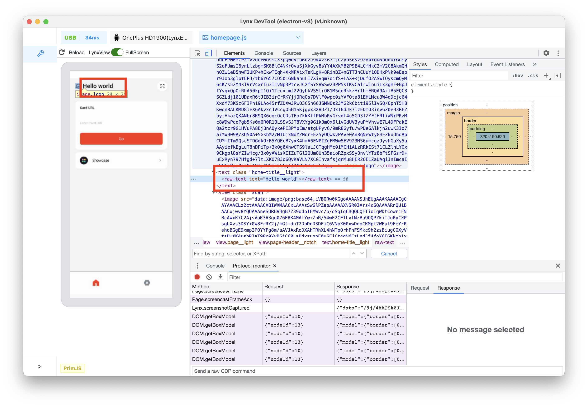

### 修改属性

如需修改属性，请双击属性名称或值。请按照以下说明了解如何向节点修改 style 属性。

1. 元件树选中要修改的 `<view clip-radius="true" flatten="false" style="height:100px">` 节点。

   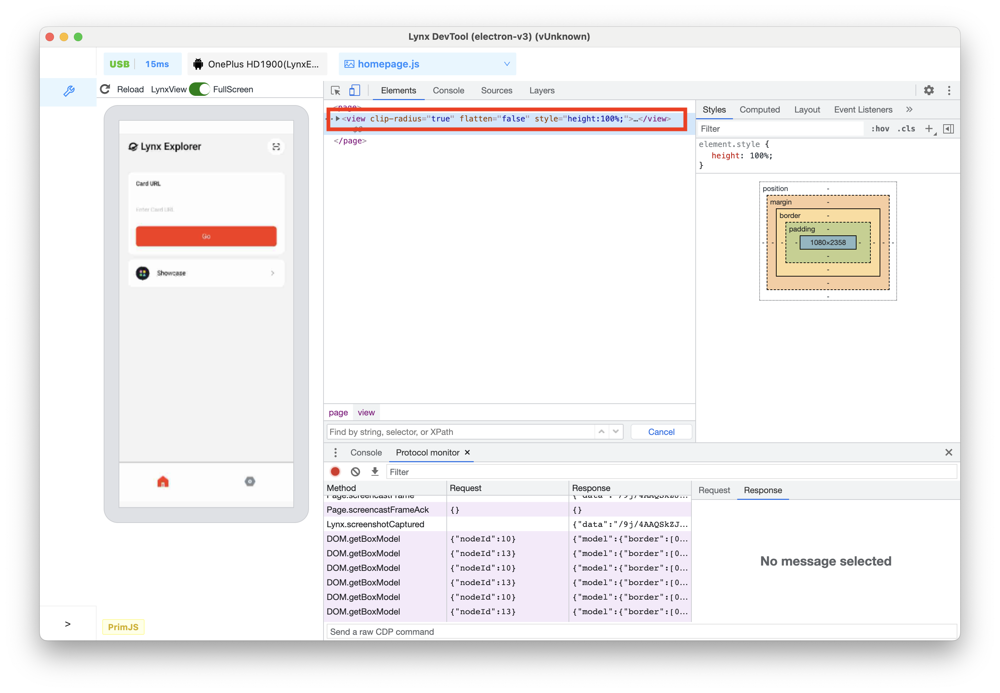

2. 双击显示 `style="height:100px;"` 部分, 会突出显示该文本。

3. 修改 **style** 内容为 `style="width:70%;height:100px;"`。

   

4. 按下回车键，可以看到无论是元件树还是左侧预览窗口，view 节点的宽度改动均已生效。
   

## 查看和更改 CSS

### 查看元素的 CSS

1. 点击 **Inspect** 图标，在预览窗口点击 **Lynx Explorer** 文字。

2. 元件树选中了 `<text class="home-title__light">...</text>` 节点。

3. 此时可以看到 **Styles** 标签页展示了当前选中节点所有应用的样式。

   

4. 上方选项卡切换到 **Computed** 标签页，可以看到选中节点的 Box model，以及所有最终应用于该节点的已解析样式。

### 向元素添加 CSS 声明

如果你想更改或向元素添加 CSS 声明，请使用 **Styles** 标签页。

1. 元件树选择 `<view clip-radius="true"...>...</text>` 节点。

2. 在右侧的 **Styles** 标签页，点击最上面的 `element.style`。

3. 点击后输入框先打属性名 `border`, 按回车键。跳出第二个输入框，输入 `black 20px`。

   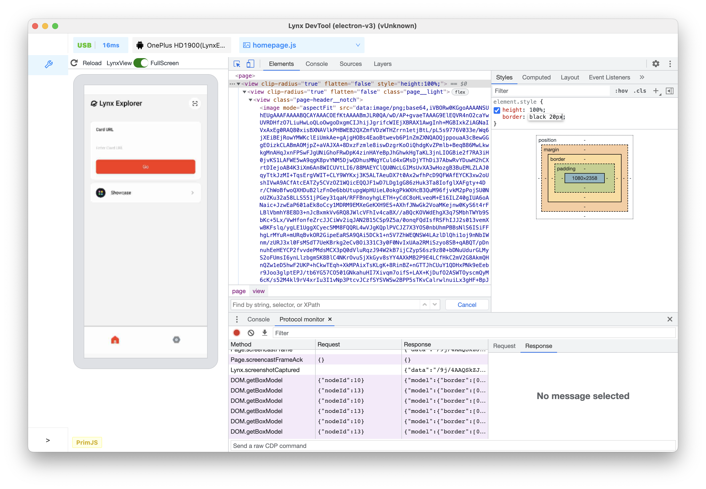

4. 再次按下回车键，此时无论是预览窗口上的 UI 效果，还是元件树上，样式改动均已生效。
   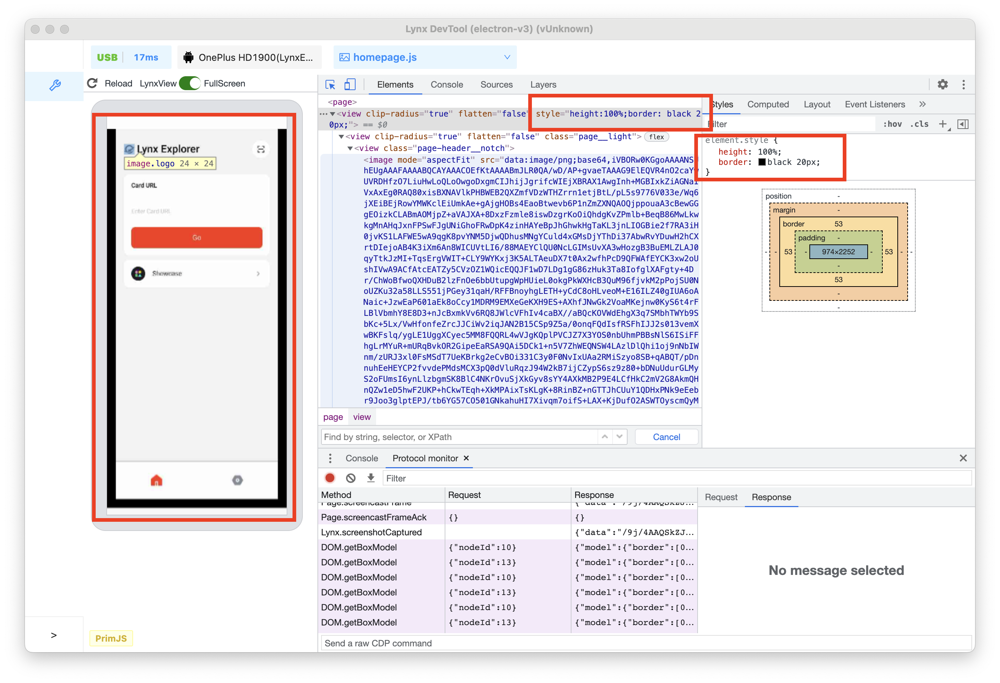

### 通过 Box model 与预览窗口中元素的交互

1. 点击 **Inspect** 图标，鼠标悬停在预览窗口的 **Go** 按钮上。

2. 左侧预览窗口高亮出了节点所有的 Box model，从里到外依次是 **content-box**/ **padding-box** / **border-box** / **margin-box**。

   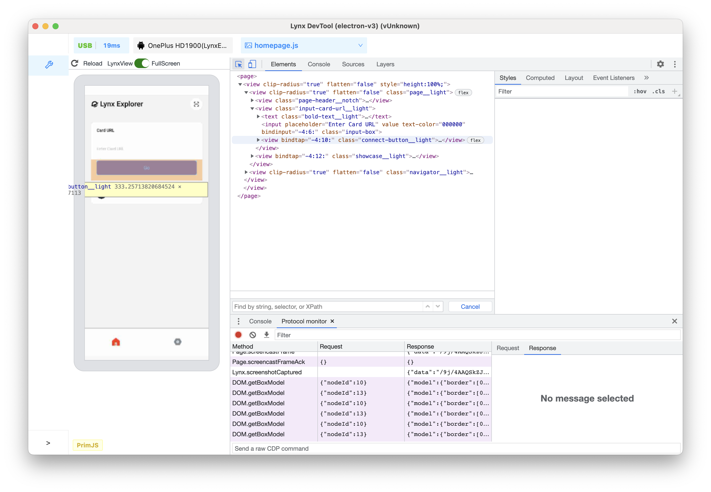

3. 鼠标点击 **Go** 按钮，选中该节点，此时元件树选中了 `<view ...>...</view>` 节点

4. 查看右侧 **Styles** 标签页中的 Box model，由里到外逐一点击，可以看到左侧预览窗口依次逐个高亮。以 content-box 为例，如下图所示：
   

## 查找无效或已替换和其他 CSS

### 检查你编写的 CSS

假设你在某个元素中添加了一些 CSS，并希望确保新样式得到正确应用。当你刷新页面时，元素看起来和以前一样。出了点问题。

首先要检查元素，并确保新的 CSS 确实已应用于该元素。

有时，你会在 **Elements** 面板 > **Styles** 标签页中看到新 CSS，但新 CSS 呈现的是淡文本、不可修改、被划掉，或者旁边显示警告或提示图标。

### 了解 **Styles** 标签页中的 CSS

**Styles** 标签页可识别多种 CSS 问题，并以不同的方式突出显示这些问题。

#### 值无效和声明

**Styles** 标签页会划掉以下内容，并在以下内容旁边显示警告图标：

- CSS 属性无效或未知时，整个 CSS 声明（属性和值）。
- 在 CSS 属性有效但值无效时，整个 CSS 声明（属性和值）。

#### 已替换

**Styles** 标签页会根据级联顺序划掉被其他属性覆盖的属性。

在本例中，元素上的 `color:red;` 样式属性会替换 `.banner .title` 类上的 `color:linear-gradient(120deg ,#0095ff 30% ,#42d392 100%);`。

#### 继承和非继承

**Styles** 标签页会根据属性的默认继承关系在 `Inherited from <element-name>` 部分中列出属性：

- 默认情况下会以常规文本形式沿用。
- 默认情况下，非继承内容以浅文字显示。

