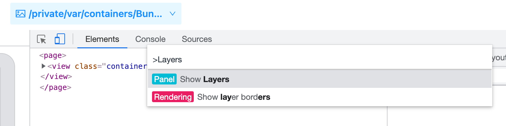
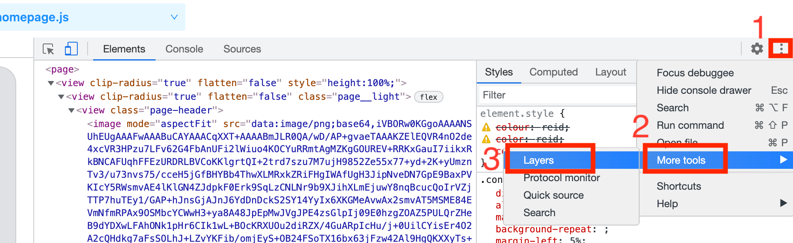
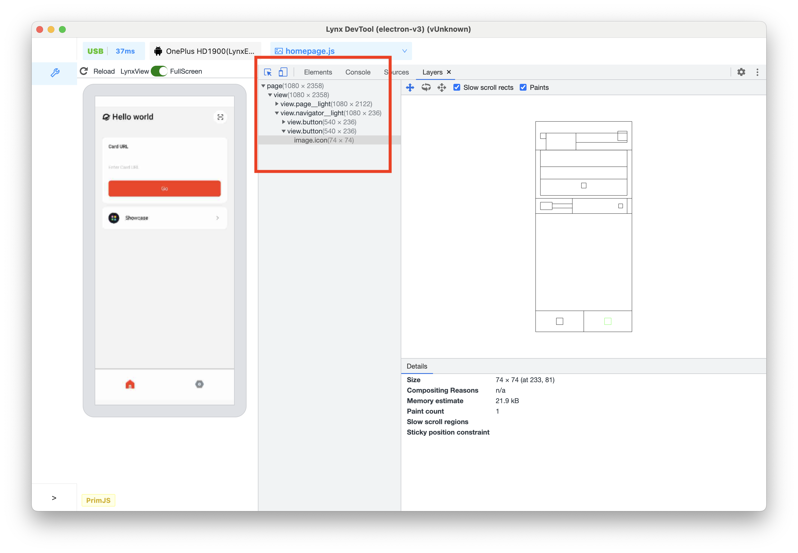
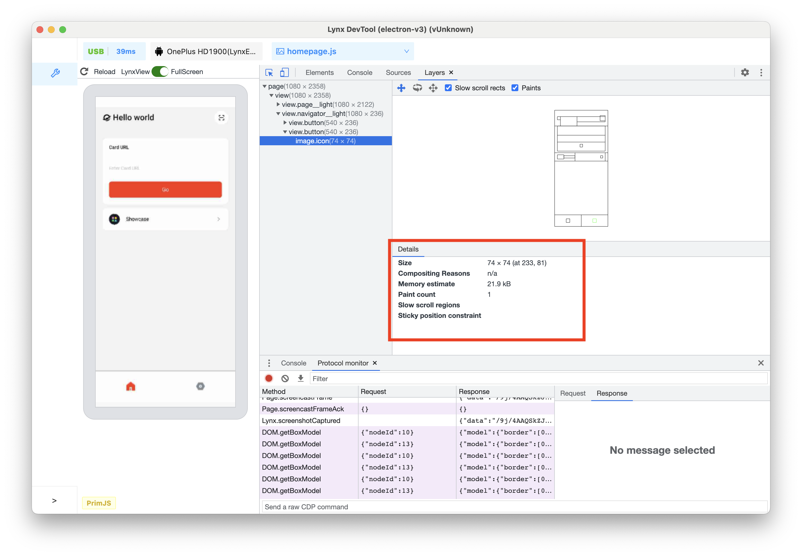
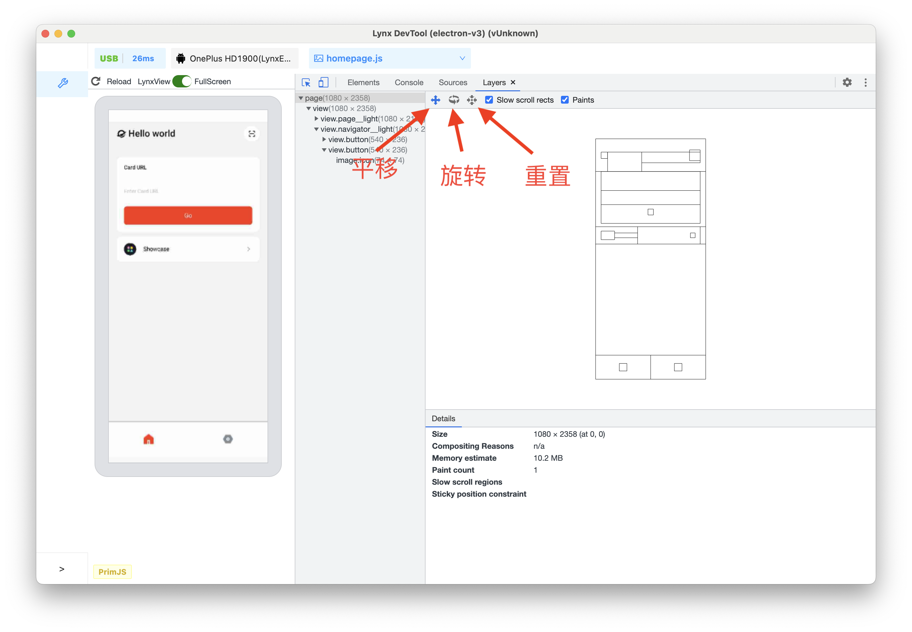
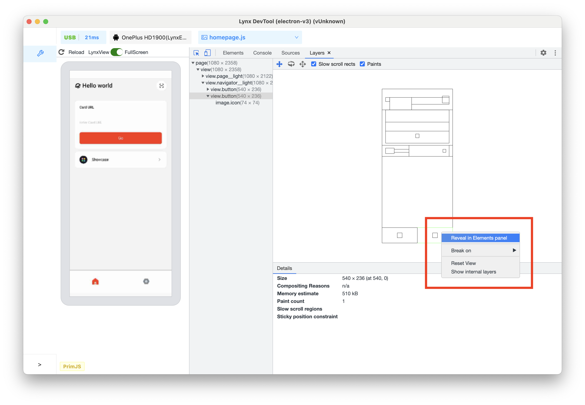

# Layers 面板

**Layers** 面板可帮助你了解 Lynx 页面的组成以及框架如何呈现内容，分析其 3D 图层，以发现渲染问题。

## 概览

使用 **Layers** 面板执行以下操作：

- 查看页面图层
- 检查页面图层

### 打开 Layers 面板

如需打开 Layers 面板，请按以下步骤操作：

1. 按 **Command+Shift+P** 打开命令菜单。
2. 开始输入 **Layers**, 选择 **Show Layers**, 然后按 **Enter** 键。
   

或者，选择右上角的更多选项-> **More tools** -> **Layers**。

    

## 查看页面图层

**Layers** 面板的最左侧部分会在可展开的树中列出 Lynx 页面的所有已呈现层。此树状结构会随着移动端 **Lynx** 页面的更新而更新。图层通过其 **CSS** 选择器或者数字（后跟图层尺寸（以像素为单位））进行标识。

    

将鼠标悬停在某个图层上，即可在 Lynx 页面预览窗口突出显示该图层，并有一条提示，其中包含以下信息：

- 图层的选择器
- 图层的尺寸（以像素为单位）
  

## 检查页面图层

点击某个图层，即可在 **Details** 窗格中查看更多信息。

    

根据不同的图层，系统会显示以下信息：

- 大小
- 合成原因
- 内存估算
- 绘制次数

下图显示了此 **Lynx** 页面的层叠和排列方式。

    

如需移动图表，请执行以下操作：

- 使用 **WASD** 移动图表。按 W 可向上平移，按 A 向左平移，按 S 向下平移，按 D 向右平移。
- 点击**平移模式**图标即可沿 X 轴和 Y 轴移动。
- 点击**旋转模式**图标即可沿 Z 轴旋转。
- 点击**重置转换**将图表重置为原始位置。
- 鼠标滚轮向上可放大视图。
- 鼠标滚轮向下可缩小视图。

要在 **Elements** 面板中查看图层对应的 **DOM** 元素，请右键点击图表或图层树中的相应层，然后点击 **Reveal in Elements panel**。

