import show_navigator from './assets/sources/show-navigator.png?inline';
import match_case from './assets/sources/match-case.png?inline';
import use_regular from './assets/sources/use-regular.png?inline';
import refresh from './assets/sources/refresh.png?inline';
import clear from './assets/sources/clear.png?inline';
import deactivate_bp from './assets/sources/deactivate-bp.png?inline';
import more_options from './assets/sources/more-options.png?inline';
import { Badge } from '@lynx';

<style jsx>{`
  .inline-content {
    display: flex;
    align-items: center;
    flex-wrap: wrap;
  }
  .inline-content img {
    margin: 0 5px;
    height: 2rem;
  }
  .margin {
    margin-top: 1rem;
    margin-bottom: 1rem;
  }
  .margin2 {
    margin-top: 0.5rem;
  }
`}</style>

# Sources 面板

使用 **Sources** 面板来调试 JavaScript。在开始调试之前，你可以先了解 Lynx 的 [JavaScript 运行环境](guide/scripting-runtime/index#javascript-运行时)。

启用 DevTool 后，后台线程默认使用 PrimJS 引擎来进行调试。在 Android 端，你也可以切换到 V8 引擎来获得更完整的调试体验。

打开 [DevTool 开关页面](guide/start/integrate-lynx-devtool-advanced.html#debugging-devtool-switch)，将“**V8 引擎**”切换为“**On**”并重启应用，即可在后台线程使用 V8 引擎。你可以在[预览窗口](guide/debugging/lynx-devtool/elements-panel#预览窗口介绍)的左下角查看当前的引擎类型。

## 概览

**Sources** 面板主要分为以下三个区域：

1. **文件导航窗格**。被调试页面的所有 JavaScript 文件都会展示在这里。
2. **代码编辑窗格**。在文件导航窗格中选中某个文件之后，该文件的内容会展示在这里。
3. **调试窗格**。这里包括调试 JavaScript 的各种工具。


## 文件导航

### 打开文件

可以使用**文件导航窗格**或 **Open file** 功能来打开感兴趣的文件。

<div class="inline-content margin">
  <span>点击 **More Options** </span>
  
  <span>并选择 **Open file**，会弹出对话框。</span>
</div>

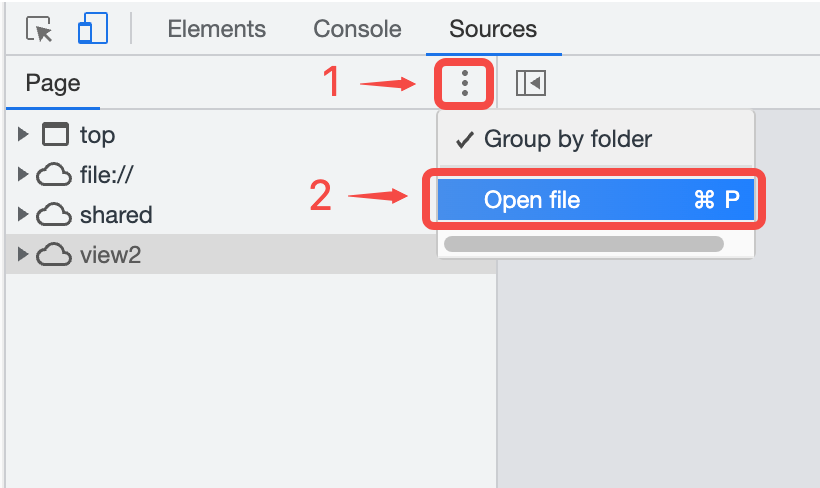

可以在这里输入文件 URL，或在下拉列表中选择文件。

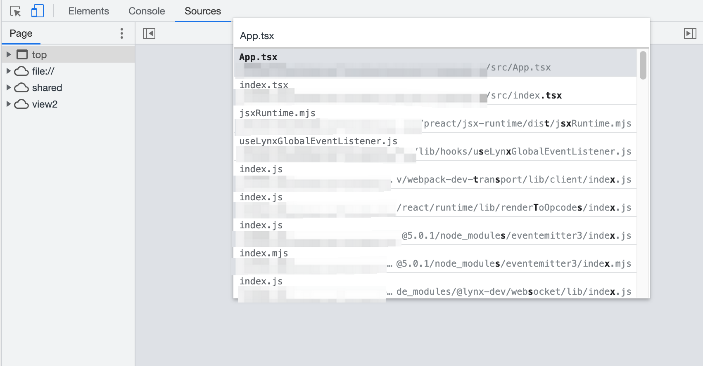

**代码编辑窗格**的底部操作栏中会显示当前鼠标位置的行列号。

<div class="inline-content margin">
  <span>单击 **Show navigator** </span>
  
  <span>可以收起/展开**文件导航窗格**。</span>
</div>


### 关闭文件

可以通过以下方式来关闭文件：

- 鼠标悬停在**代码编辑窗格**上方的文件名选项卡，点击**关闭**按钮。
  
- 右键单击**代码编辑窗格**上方的文件名选项卡：
  - Close：关闭当前文件。
  - Close others：关闭其他文件。
  - Close all：关闭所有文件。
    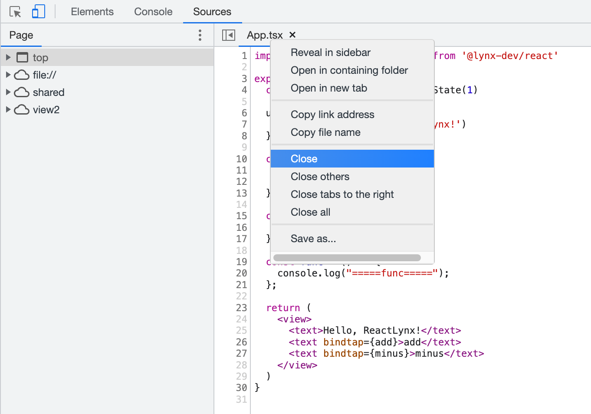

### 定位文件

当你想快速定位当前**代码编辑窗格**中展示的文件在**文件导航窗格**中的位置时，可以按照下列步骤操作：

1. 右键单击**代码编辑窗格**中的任意位置，或右键单击**代码编辑窗格**上方的文件名选项卡。
2. 选择 **Reveal in sidebar**。


### 搜索代码

当你想快速查找代码段所属的文件时，可以按照下列步骤操作：

1. <div class="inline-content margin">
     <span>点击 **Customize And Control DevTools**</span>
     
     <span> > **Search**，打开**搜索**面板。</span>
   </div>
   
2. 在搜索栏中输入文本，然后按 Enter 键进行查找。
3. 在搜索结果中点击你感兴趣的代码，会跳转到对应文件，并高亮显示这段代码。
   

你也可以：

- <div class="inline-content margin2">
    <span>点击 **Match Case** </span>
    
    <span>使查询区分大小写。</span>
  </div>
- <div class="inline-content margin2">
    <span>点击 **Use Regular Expression** </span>
    
    <span>以使用正则表达式进行搜索。</span>
  </div>
- <div class="inline-content margin2">
    <span>点击 **Refresh** </span>
    
    <span>来重新搜索。</span>
  </div>
- <div class="inline-content margin2">
    <span>点击 **Clear** </span>
    
    <span>来清空输入内容。</span>
  </div>

## 使用断点暂停代码

通过添加断点，你可以在代码执行过程中暂停，并且能够检查这个时刻的所有相关值。

目前支持的断点类型如下：

|             类型              | 描述                                         |
| :---------------------------: | -------------------------------------------- |
|     [代码行](#代码行断点)     | 在确切的代码区域中暂停                       |
| [条件代码行](#条件代码行断点) | 在确切的代码区域中暂停，但仅当某些条件为真时 |
| [日志代码行](#日志代码行断点) | 将消息记录到 Console ，而不会暂停执行        |
|       [首行](#首行断点)       | 在首个被执行的 JavaScript 文件的首行暂停     |
|       [异常](#异常断点)       | 在引发异常的代码行暂停                       |

### 代码行断点

请参考[代码行断点 | Chrome DevTools](https://developer.chrome.com/docs/devtools/javascript/breakpoints?hl=zh-cn#loc)。

#### 代码中的代码行断点

请参考[代码中的代码行断点 | Chrome DevTools](https://developer.chrome.com/docs/devtools/javascript/breakpoints?hl=zh-cn#debugger)。

#### 条件代码行断点

请参考[条件代码行断点 | Chrome DevTools](https://developer.chrome.com/docs/devtools/javascript/breakpoints?hl=zh-cn#conditional-loc)。

#### 日志代码行断点

请参考[记录代码行断点 | Chrome DevTools](https://developer.chrome.com/docs/devtools/javascript/breakpoints?hl=zh-cn#log-loc)。

#### 管理代码行断点

右键单击断点图标，或使用 **Breakpoints** 窗格来管理代码行断点。

- 右键单击断点标记，选择 **Edit breakpoint**，可以进行进行修改，也可以从编辑对话框的下拉列表中更改其类型。
  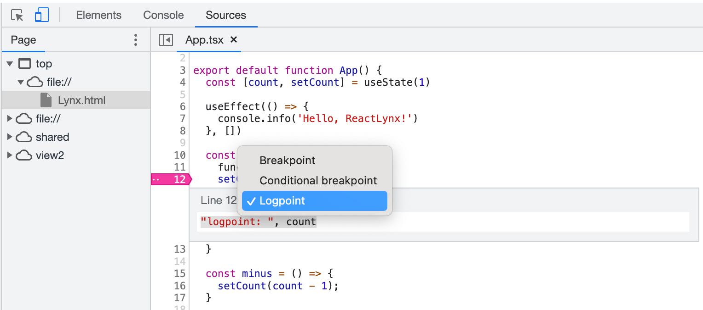
- 再次单击断点标记，可以删除该断点。
- 在 **Breakpoints** 窗格中，点击断点条目旁边的复选框以启用或停用该断点。停用断点后，行号旁的标记会变为透明。

  

- 右键单击断点标记，可以查看功能选项菜单：
  - Remove breakpoint：删除断点。
  - Edit breakpoint：编辑断点。
  - Disable/Enable breakpoint：停用/启用断点。
    
- 右键单击 **Breakpoints** 窗格中的断点条目，可以查看功能选项菜单：
  - Remove breakpoint：删除断点。
  - Reveal location：显示位置。
  - Deactivate/Activate breakpoints：忽略/激活断点。
    <div class="inline-content margin2">
      <span>也可以使用 **Deactivate breakpoints** </span>
      
      <span>按钮来忽略断点。</span>
    </div>
    忽略断点后，DevTool
    会忽略所有代码行断点，断点都不会被触发，但同时保持其启用状态，以便在你重新激活时它们处于与之前相同的状态。
  - Disable/Enable all breakpoints：停用/启用所有断点。
  - Disable/Enable breakpoints in file：停用/启用此文件中的所有断点。
  - Remove all breakpoints：删除所有断点。
  - Remove other breakpoints：删除其他断点。
    

#### 使用“永不在此处暂停”跳过断点<Badge>后台 V8 Only</Badge>

请参考[使用“一律不在此处暂停”跳过断点 | Chrome DevTools](https://developer.chrome.com/docs/devtools/javascript/breakpoints?hl=zh-cn#never-pause-here)。

### 首行断点<Badge>后台 Only</Badge>

开启首行断点，可以在每个被执行的 JavaScript 文件的入口处暂停。

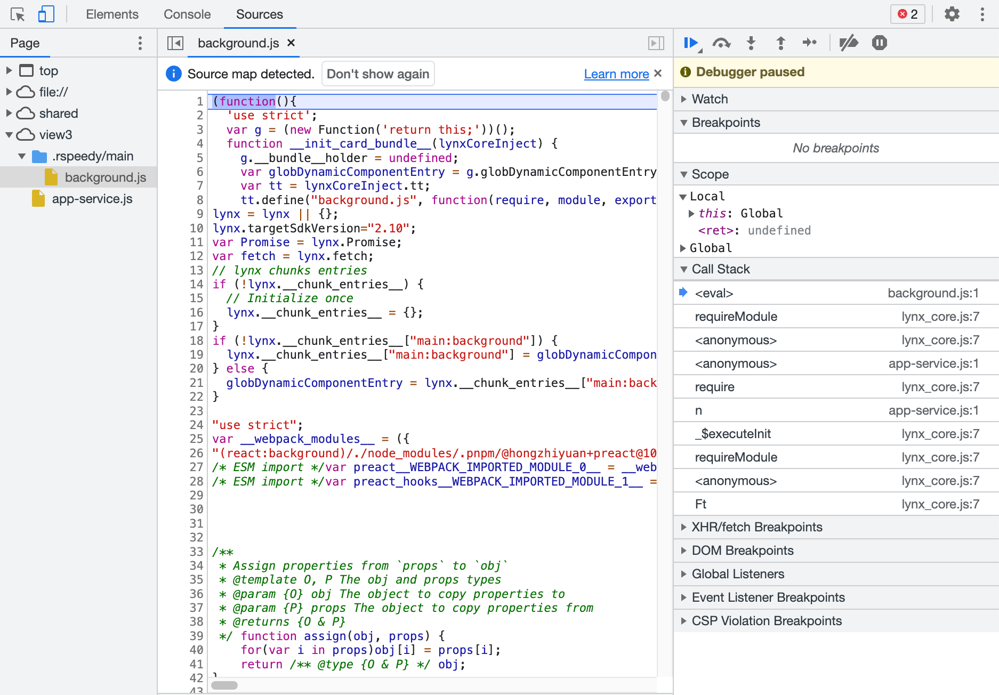

鼠标悬停在下图位置，然后开启 **First-Line Breakpoints**。这是一个非持久化的全局开关，开启后在一次 APP 运行过程中对所有页面生效，关闭 APP 并重新打开后，开关状态会失效。


通过以下两种方式来调试首行断点：

1. 先开启开关，再打开需要调试的页面。
2. 先打开需要调试的页面，再开启开关，然后[刷新](./elements-panel#预览窗口介绍)页面。

### 异常断点

当你想在引发异常的代码行上暂停时，可以使用异常断点。

1. 在 **Breakpoints** 窗格中，单击 **Pause on exceptions** 按钮，启用时变为蓝色。
2. 默认情况下只会在未捕获的异常处暂停，如果你还想暂停捕获的异常，请选中 **Pause On Caught Exceptions** 复选框。


:::warning
目前 PrimJS 引擎不区分是否为捕获的异常，所有异常都会暂停。V8 引擎会区分是否为捕获的异常。
:::

## 调试 JavaScript 代码

默认情况下，只可调试后台线程，如果需要调试主线程，请参考下文[调试主线程 JavaScript 代码](#调试主线程-javascript-代码)。

### 单步调试代码

一旦你的代码暂停，可以一次一行地单步执行，并在此过程中查看控制流和属性值。


#### Step over

请参考[单步调试代码行 | Chrome DevTools](https://developer.chrome.com/docs/devtools/javascript/reference?hl=zh-cn#step-over)。

#### Step into

请参考[单步进入代码行 | Chrome DevTools](https://developer.chrome.com/docs/devtools/javascript/reference?hl=zh-cn#step-into)。

#### Step out

请参考[退出代码行 | Chrome DevTools](https://developer.chrome.com/docs/devtools/javascript/reference?hl=zh-cn#step-out)。

#### 运行某一行代码之前的所有代码<Badge>后台 V8 Only</Badge>

请参考[运行某一行代码之前的所有代码 | Chrome DevTools](https://developer.chrome.com/docs/devtools/javascript/reference?hl=zh-cn#continue-to-here)。

#### Resume

请参考[继续执行脚本 | Chrome DevTools](https://developer.chrome.com/docs/devtools/javascript/reference?hl=zh-cn#resume)。

##### 停止执行<Badge>后台 V8 Only</Badge>

要在暂停后停止继续执行 JavaScript，请长按 **Resume** 按钮，然后选择 **Terminate script execution** 按钮。

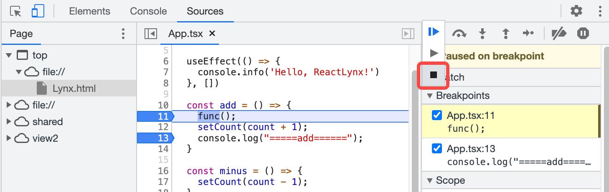

例如，本例中，选择 **Terminate script execution**，则程序停止执行，即 `add` 函数中的代码都不会被执行，可以看到 `count` 的值不会发生变化。

### 查看和修改属性

请参考[查看和修改局部、闭包和全局属性 | Chrome DevTools](https://developer.chrome.com/docs/devtools/javascript/reference?hl=zh-cn#scope)。

### 查看当前的调用堆栈

当程序暂停在代码行上时，可以使用 **Call Stack** 窗格查看此刻的调用堆栈。

单击窗格中的条目可跳转到调用该函数的代码行，蓝色箭头图标指出了当前正在高亮的代码。

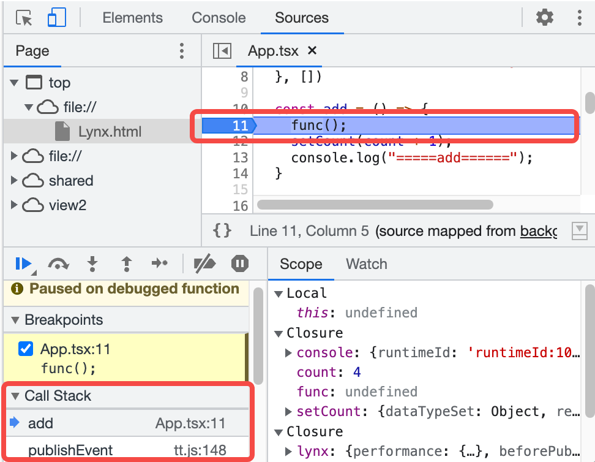

#### 复制调用堆栈

右键单击 **Call Stack** 窗格中的任意位置，然后选择 **Copy stack trace**，则能够将当前调用堆栈复制到剪贴板。

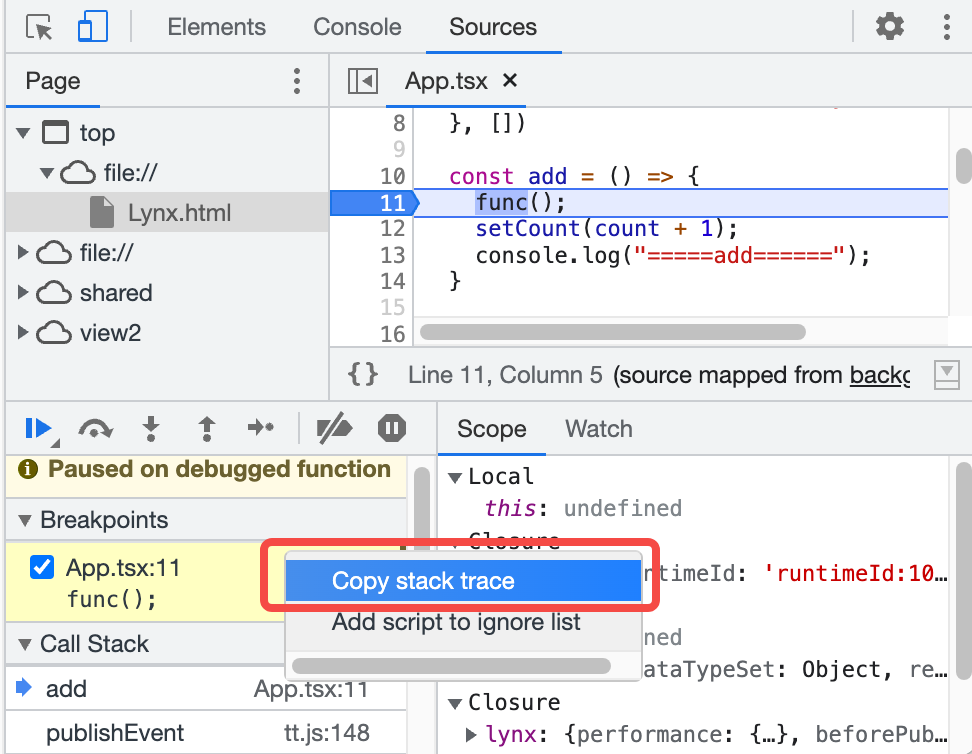

例如，本例中，复制的堆栈如下：

```
add (App.tsx:11)
publishEvent (tt.js:148)
```

### 忽略脚本<Badge>后台 V8 Only</Badge>

在调试时忽略某些脚本以跳过它。忽略时，脚本在 **Call stack** 窗格中会隐藏，当你单步执行代码时，永远不会进入被忽略的脚本的函数。

#### 在代码编辑窗格中进行忽略

请参考[从“编辑器”窗格中忽略脚本 | Chrome DevTools](https://developer.chrome.com/docs/devtools/javascript/reference?hl=zh-cn#editor-ignore-list)。

#### 通过 Call Stack 窗格进行忽略

请参考[在“调用堆栈”窗格中忽略脚本 | Chrome DevTools](https://developer.chrome.com/docs/devtools/javascript/reference?hl=zh-cn#call-stack-ignore-list)。

#### 显示忽略的帧

如果需要查看完整的调用堆栈，请在 **Call Stack** 窗格中点击 **Show ignore-listed frames**，然后被忽略的帧会被展开，但显示为灰色。

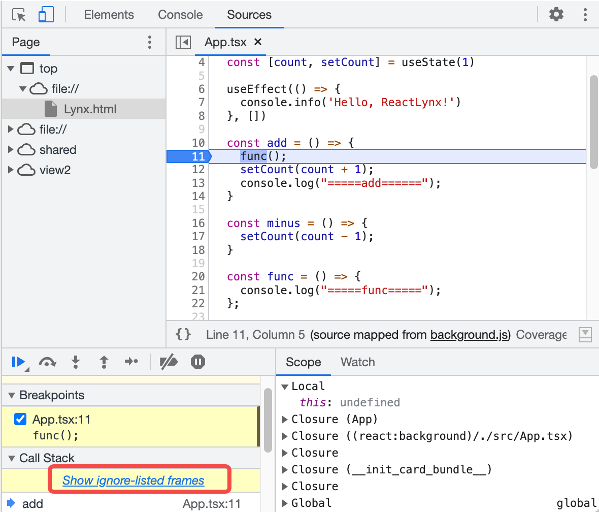
<br />


#### 取消忽略

忽略脚本后，再次通过上述两种途径，选择 **Remove from ignore list** 即可取消忽略。

此外还可以通过**代码编辑窗格**上方的提示来取消忽略。


### 监控自定义 JavaScript 表达式的值

请参考[监控自定义 JavaScript 表达式的值 | Chrome DevTools](https://developer.chrome.com/docs/devtools/javascript/reference?hl=zh-cn#watch)。

### 检查和修改脚本

在**代码编辑窗格**中，可以浏览和修改代码。

#### 使压缩后的文件可读

单击编辑器底部操作栏的 `{}`，**Sources** 面板会以美观的格式展示被压缩的文件，提高可读性。


<br />


#### 修改脚本<Badge>后台 V8 Only</Badge>

请参考[修改脚本 | Chrome DevTools](https://developer.chrome.com/docs/devtools/javascript/reference?hl=zh-cn#edit)。

:::warning
只可以修改编译后的 JavaScript 文件，通过 SourceMap 反解出的原始文件不可修改，且页面刷新后修改内容不会保存。
:::

#### 在脚本中搜索和替换文本

请参考[在脚本中搜索和替换文本 | Chrome DevTools](https://developer.chrome.com/docs/devtools/javascript/reference?hl=zh-cn#search)。

替换完成后，需要手动保存脚本，参考上文[修改脚本](#修改脚本)。

## 使用 SourceMap 调试原始代码<Badge>后台 Only</Badge>

[配置 SourceMap](api/rspeedy/rspeedy.output.sourcemap) 后，你可以直接在 Sources 面板中调试你编写的原始代码。

### 检查 SourceMap 是否成功加载

#### 查看加载状态

当你打开 DevTool 时，它会尝试加载 SourceMap（如果有）。

加载成功时，在**文件导航窗格**中，橙色文件夹的部分即为原始源文件。


如果加载失败或 SourceMap 存在问题，**Console** 中会记录类似以下内容的错误。


当你打开任何编译后的文件时，DevTool 都会通知你是否找到了 SourceMap。


#### 手动加载 SourceMap

你可以通过以下方式来手动加载 SourceMap：

1. 打开编译后的文件，在**代码编辑窗格**中右键点击任意位置，选择 **Add source map**。
   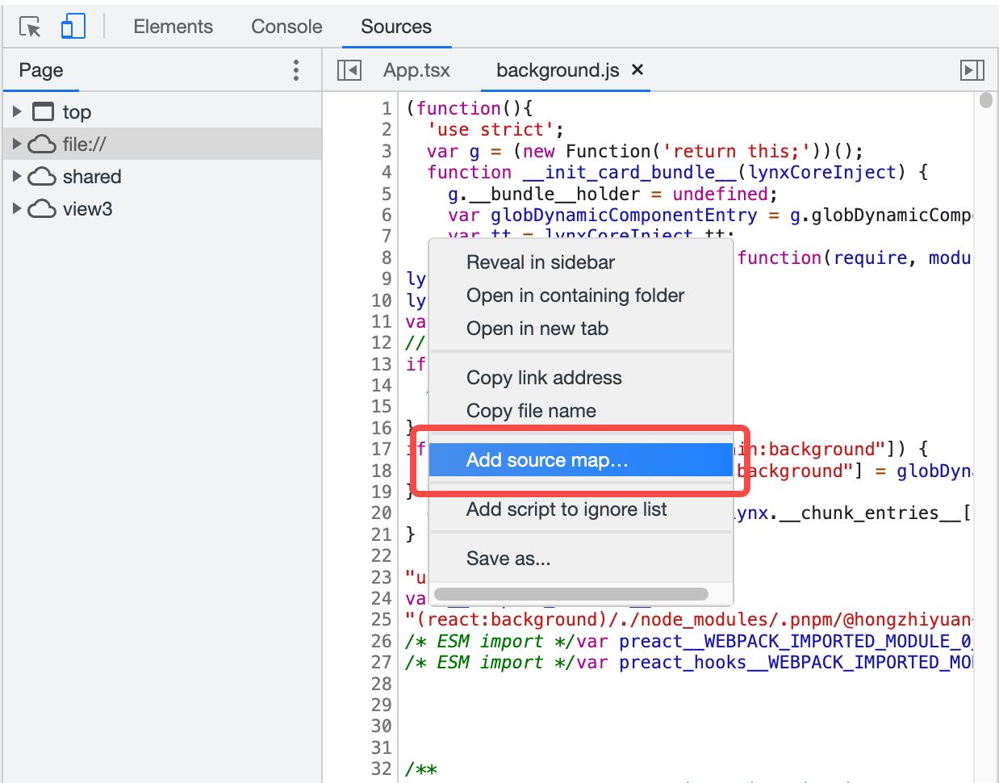
2. 在文本看中输入 SourceMap 的 URL，然后点击 **Add**。
   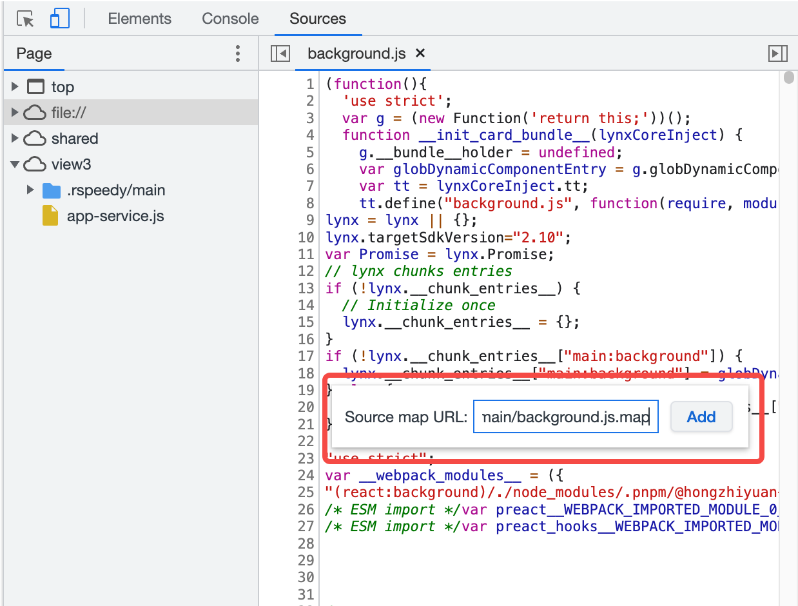

### 使用 SourceMap 进行调试

1. 在原始文件中，你可以按照常规方式[设置断点](#使用断点暂停代码)，也可以在编译后的文件中设置断点，DevTool 会自动跳转到原始文件中。
2. 触发断点并暂停后，**Call Stack** 窗格中将显示原始文件的名称。
   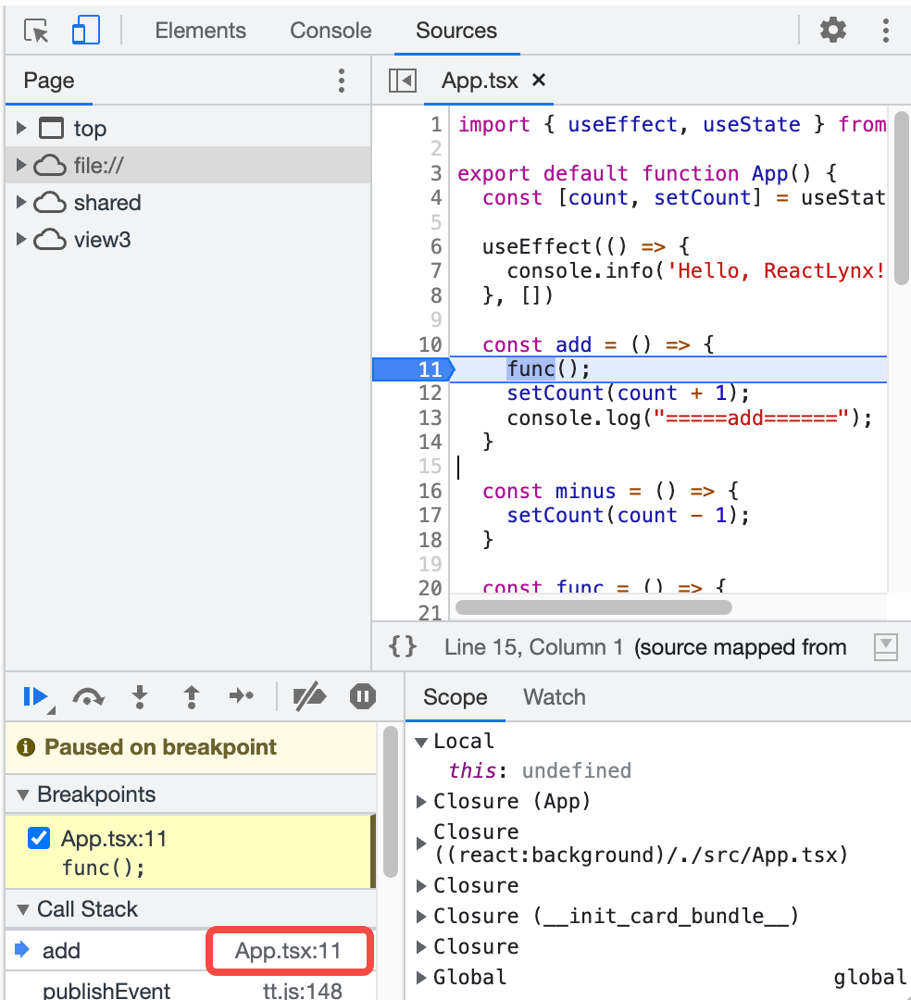
3. **代码编辑窗格**底部操作栏会展示其指向的编译后文件的链接，点击后会跳转到对应的文件。
   

## 调试主线程 JavaScript 代码

主线程的调试方式与后台线程基本相同，但需要一些步骤来启用。

### 前置准备

调试主线程，需要使用 rspeedy 在 **dev** 模式下启动项目。

你可以检查以下两项内容，以保证做好了前置准备：

1. 在[中间产物目录](api/rspeedy/rspeedy.distpath.intermediate)下，生成了 `debug-info.json` 文件。
   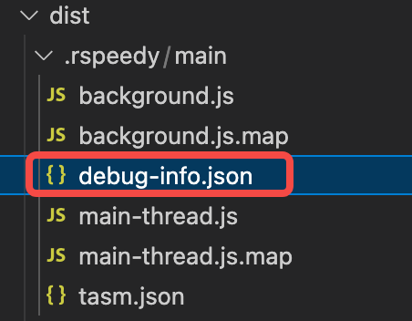
2. 在[中间产物目录](api/rspeedy/rspeedy.distpath.intermediate)的 `tasm.json` 文件中，`templateDebugUrl` 字段是一个有效的 URL，其指向步骤一中提到的 `debug-info.json` 文件。参考 [rspeedy.dev.assetprefix](api/rspeedy/rspeedy.dev.assetprefix)。
   

### 开启主线程调试

鼠标悬停在下图位置，然后开启 **Main Thread Debugging**。这是一个非持久化的全局开关，开启后在一次 APP 运行过程中对所有页面生效，关闭 APP 并重新打开后，开关状态会失效。

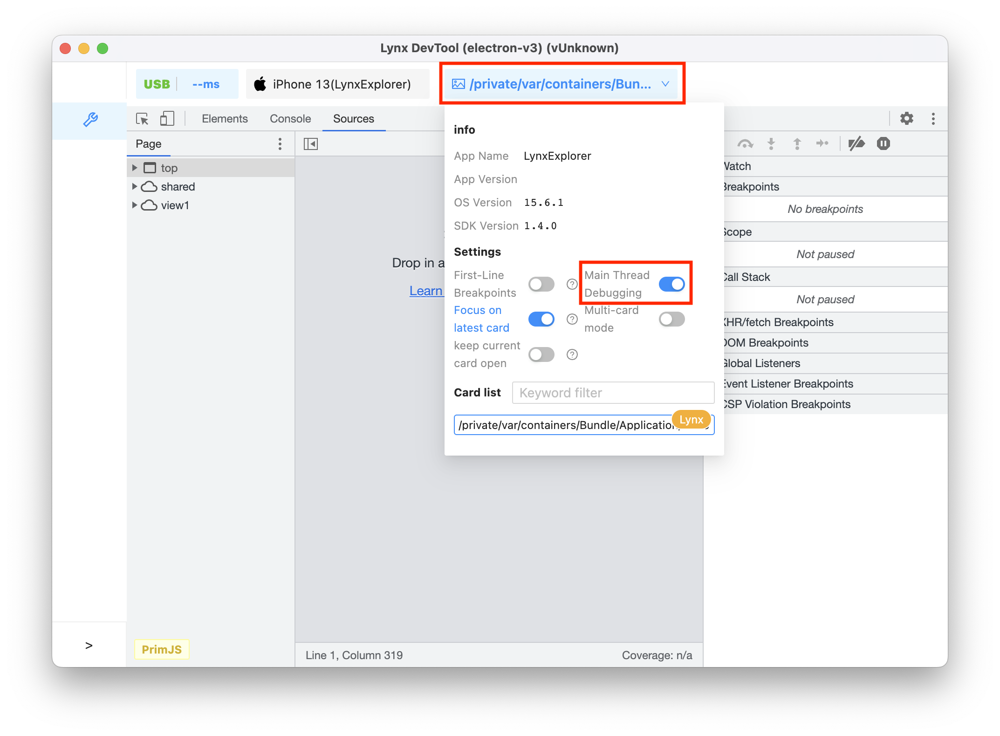

你可以按下列步骤来启用主线程调试：

1. 先开启开关，再打开需要调试的页面；或先打开需要调试的页面，再开启开关，然后[刷新](./elements-panel#预览窗口介绍)页面。
2. 主线程的 `main-thread.js` 文件会展示在**文件导航窗格**（旧称 `lepus.js`）。
3. 在 **Threads** 窗格中，切换到 **Main**，即可开始调试。


在 **Threads** 窗格中，可以切换调试主线程还是后台线程，蓝色箭头图标表示当前选定的线程，当前暂停的线程后面会显示 **paused**。
