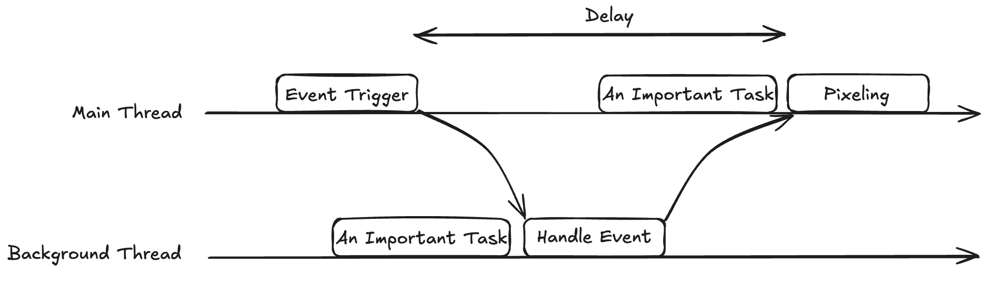
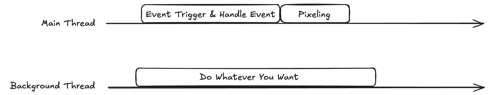

import { Go } from '@lynx';

# 主线程脚本

主线程脚本（Main Thread Script）是能够在主线程执行的 JS 脚本。主线程脚本的最常使用场景是跟手动画和手势处理，主要用于解决 Lynx 多线程架构下的响应延迟问题，来达到近似原生的交互体验。

## Lynx 中的事件响应延迟

这里有一个简单的动画：一个与 `scroll-view` 同步移动的小方块。在小方块组件中，我们监听了滚动视图的滚动事件，从事件参数中获取当前滚动位置，并立即更新自己的位置：

<Go
  example="main-thread"
  img="/assets/bg-draggable.gif"
  defaultEntryFile="dist/background-draggable.lynx.bundle"
  defaultFile="src/background-draggable/BackgroundDraggable.tsx"
  entry="src/background-draggable"
/>

你可以尝试滚动示例左侧的 `scroll-view`。页面右侧的蓝色方块将会随之移动。然而，你可能会注意到它的移动存在一种难以预料的延迟，尤其是在低性能设备上。当页面的复杂度增加时，这种延迟也会相应加剧。

这是因为在 Lynx 的架构下，事件会在主线程触发，而普通的事件处理函数只能在后台线程执行。因此事件触发 -> 事件处理 -> 绘制流程中会有多次线程切换，导致响应不及时，动画效果相比手势滞后。



为了解决这个问题，Lynx 提供了主线程脚本。主线程脚本通过在主线程同步处理事件的能力保证事件能够被同步响应。



## 使用主线程脚本来消除动画延迟

### 使用主线程脚本实现动画

使用主线程脚本同步处理事件非常简单。这里我们尝试修改一下之前的示例。

首先，我们通过在事件属性名称中添加 `main-thread` 命名空间来通知框架我们想要在主线程上处理此事件：

```tsx
<view main-thread:global-bindscroll={onScroll} />
```

我们还需要将 `onScroll` 函数声明为主线程函数。实现方式是：在函数体的首行添加一个 `'main thread'` 指令。

```ts
let onScroll = (event) => {
  'main thread';
  // ...
};
```

在将其声明为主线程函数后，我们就不能再从后台线程调用它了。

最后，因为我们现在可以在主线程中直接操作元件的属性，所以不再需要通过 `state` 来改变位置。
在将主线程函数用作事件处理器时，主线程函数接受一个 `event` 参数，包含事件的基本信息。
其 `event.target` 和 `event.currentTarget` 参数和普通的事件处理器不同，是一个 [`MainThread.Element`](api/lynx-api/main-thread/main-thread-element) 对象。
通过这个对象可以方便地同步获取和设置节点的属性，例如示例中的 `setStyleProperty()`。

```tsx
let onScroll = (event) => {
  'main thread';
  const detail = event.detail.scrollTop;
  const newPos = {
    x: 0,
    y: 500 - detail,
  };
  event.currentTarget.setStyleProperty(
    'transform',
    `translate(${newPos.x}px, ${newPos.y}px)`,
  );
};
```

以上就是所需的全部更改了。我们会在同一个示例中放置修改前后的组件，方便你对比效果。你可能会注意到，动画的延迟已经消失了！

<Go
  example="main-thread"
  img="/assets/mt-draggable.gif"
  defaultEntryFile="dist/main-thread-draggable.lynx.bundle"
  defaultFile="src/main-thread-draggable/MainThreadDraggable.tsx"
  entry="src/main-thread-draggable"
/>

## 从后台线程获取数据

你可能已经发现，将一个函数指定为主线程函数会使其从周围的上下文环境中脱离出来，就像一个“孤岛”。
它和其他函数的运行环境不同，因此无法自由地和后台线程或其他主线程脚本通信。
但我们有时还是需要后台线程的一些数据。

幸运的是，在主线程函数中获取后台线程的数据非常简单：只需要直接使用它，就像在一个普通函数中一样：

```tsx
export default function App() {
  const red = 'red';

  function addBackgroundColor(event: MainThread.ITouchEvent) {
    'main thread';
    event.currentTarget.setStyleProperty('background-color', red);
  }

  return (
    <view main-thread:bindtap={addBackgroundColor}>
      <text>Hello World!</text>
      <text>Hello World!</text>
    </view>
  );
}
```

主线程函数在定义时会自动捕获后台线程的外部变量，如上面示例中的 `red`。不过，你不能直接改变后台线程的值。

主线程函数所捕获的值并不是实时更新的。每次主线程函数所在的组件重新渲染后，这个值才会从后台线程同步到主线程。这个同步过程还要求所捕获的值必须是可通过 `JSON.stringify()` 序列化的。

总结一下注意事项：

- 主线程函数可以且只能在主线程运行。主线程函数之间可以互相调用。
- 捕获的变量需要使用 `JSON.stringify()` 在线程间传递，因此必须可序列化为 `JSON`。
- 主线程函数只能在 TTI 之后执行。也就是说，首屏时主线程函数不能执行。
- 主线程函数不支持嵌套定义。
- 类组件的 constructor、getter、setter 不支持指定为主线程函数。
- 不能在主线程函数内部修改捕获自外部作用域的变量。

## 通过 `main-thread:ref` 获取节点对象

在上面的示例中，对文字进行点击会使得两行文字同时变色。如果我们希望在点击文字时只让第一行文字变色，只靠 `event.target` 和 `event.currentTarget` 就不容易完成。
此时，可以通过 `main-thread:ref` 来获取主线程可用的节点对象（[`MainThread.Element`]）。

通过 [`useMainThreadRef()`] Hook 创建一个 [`MainThreadRef`]，然后将其赋值给目标节点的 `main-thread:ref` 属性：

```tsx
import { useMainThreadRef } from '@lynx-js/react';

export default function App() {
  const red = 'red';
  const textRef = useMainThreadRef<MainThread.Element>();

  function addBackgroundColor(event: MainThread.ITouchEvent) {
    'main thread';
    textRef.current?.setStyleProperty('background-color', red);
  }

  return (
    <view main-thread:bindtap={addBackgroundColor}>
      <text main-thread:ref={textRef}>Hello World!</text>
      <text>Hello World!</text>
    </view>
  );
}
```

注意 [`MainThreadRef`] 的 `current` 属性只能在主线程函数中访问。

### 向 `main-thread:ref` 传递主线程函数

类似普通的 `ref`，也可以向 `main-thread:ref` 传递主线程函数：

```tsx
import { useMainThreadRef } from '@lynx-js/react';

export function App() {
  let eleRef = useMainThreadRef<MainThread.Element>();

  function handleTapMainThread() {
    'main thread';
    eleRef.current?.setStyleProperty('height', '30px');
  }

  return (
    <view main-thread:bindTap={handleTapMainThread}>
      <view
        main-thread:ref={(ele: MainThread.Element) => {
          'main thread';
          eleRef.current = ele;
        }}
      />
    </view>
  );
}
```

你也可以在传递给 `main-thread:ref` 的主线程函数中返回一个清理函数，就像在使用普通的 `ref` 时一样。

### 在类组件内使用 `main-thread:ref`

如果你使用传统的类组件，那么无法使用 [`useMainThreadRef()`] Hook。可以直接创建 [`MainThreadRef`] 对象：

```tsx
import { MainThreadRef } from '@lynx-js/react';

class App extends Component {
  eleRef = new MainThreadRef<MainThread.Element>();

  handleTapMainThread(event: MainThread.ITouchEvent) {
    'main thread';
    this.eleRef.current?.setStyleProperty('height', '30px');
  }

  render() {
    // ...
  }
}
```

## 保存主线程函数的状态

主线程函数无法修改捕获的变量。因此，如果需要在主线程函数之间保存状态，也需要使用 [`MainThreadRef`]。

例如，根据点击次数变换节点的背景色：

```jsx
import {useMainThreadRef} from '@lynx-js/react';

function App() {
  const countRef = useMainThreadRef(0);

  function handleTapMainThread(event: MainThread.ITouchEvent) {
    'main thread';
    event.currentTarget.setStyleProperty('background-color', ++countRef.current % 2 ? 'blue' : 'green');
  }

  return (
    // ...
  );
}
```

## 跨线程函数调用

### 在后台线程中发起对主线程函数的异步调用

在后台线程使用 [`runOnMainThread()`] 来异步地在主线程执行主线程函数：

```tsx
import { useMainThreadRef, runOnMainThread } from '@lynx-js/react';

function App() {
  const countRef = useMainThreadRef(0);

  const addCount = (value: number) => {
    'main thread';
    countRef.current += value;
  };

  const doSomething = () => {
    runOnMainThread(addCount)(1);
  };
}
```

### 在主线程中发起对非主线程函数的异步调用

在主线程使用 [`runOnBackground()`] 来异步地在后台线程执行非主线程的普通函数：

```tsx
import { useState, runOnBackground } from '@lynx-js/react';

function App() {
  const [count, setCount] = useState(1);

  const onTapMainThread = (event: MainThread.ITouchEvent) => {
    'main thread';
    runOnBackground(() => {
      setCount((count) => count + 1);
    })();
  };
}
```

[`MainThread.Element`]: ../api/lynx-api/main-thread/main-thread-element.mdx
[`MainThreadRef`]: ../api/react/Class.MainThreadRef.mdx
[`useMainThreadRef()`]: ../api/react/Function.useMainThreadRef.mdx
[`runOnMainThread()`]: ../api/react/Function.runOnMainThread.mdx
[`runOnBackground()`]: ../api/react/Function.runOnBackground.mdx
